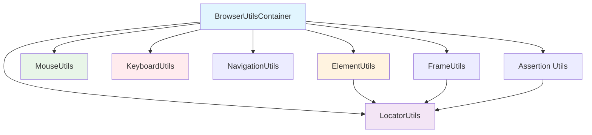

# Browser Utilities Guide

_Author: Anand Sogalad_

## 📖 Table of Contents

1. [Overview](#overview)
2. [Getting Started](#getting-started)
3. [Architecture](#architecture)
4. [Core Utilities](#core-utilities)
   - [LocatorUtils](#locatorutils)
   - [ElementUtils](#elementutils)
   - [MouseUtils](#mouseutils)
   - [KeyboardUtils](#keyboardutils)
   - [NavigationUtils](#navigationutils)
   - [FrameUtils](#frameutils)
   - [Assertion Utilities](#assertion-utilities)
5. [Container Pattern](#container-pattern)
6. [Best Practices](#best-practices)
7. [Troubleshooting](#troubleshooting)
8. [Examples](#examples)

## 🌟 Overview

The Browser Utilities are the heart of our test automation framework. They provide a clean, organized way to interact with web browsers, find elements, and validate your application's behavior.

### What Are Browser Utilities?

Browser utilities are specialized tools that make web testing easier by:

- **Simplifying element finding**: No more struggling with complex selectors
- **Providing reliable interactions**: Built-in waits and error handling
- **Offering consistent patterns**: Same approach across all tests
- **Supporting accessibility**: ARIA roles and accessible element location

### Why Use This Approach?

Instead of directly using Playwright's raw APIs, you get:

- ✅ **Consistency**: All interactions follow the same patterns
- ✅ **Reliability**: Built-in waits and error handling
- ✅ **Maintainability**: Change implementation once, fix everywhere
- ✅ **Readability**: Self-documenting, descriptive method names
- ✅ **Accessibility**: First-class support for accessible testing

## 🚀 Getting Started

### Quick Start Example

Here's how easy it is to test a web page:

```typescript
import { test, expect } from '@playwright/test';
import { BrowserUtilsContainer } from '@utils/browser';

test('Login flow example', async ({ page }) => {
  // Step 1: Create the utilities container
  const utils = new BrowserUtilsContainer(page);

  // Step 2: Navigate to the page
  await utils.navigationUtil.goTo('https://example.com/login');

  // Step 3: Fill in the form
  await utils.elementUtil.fill('#email', 'user@example.com');
  await utils.elementUtil.fill('#password', 'password123');
  await utils.elementUtil.check('#remember-me');

  // Step 4: Submit and verify
  await utils.elementUtil.click('#login-button');
  await utils.locatorAssertionUtil.assertElementIsVisible('#dashboard');

  // Step 5: Check page content
  await utils.pageAssertionUtil.assertPageHasTitle('Dashboard');
});
```

That's it! The utilities handle all the complex stuff like waiting for elements, error handling, and providing clear error messages.

### Basic Workflow

1. **Import** the utilities you need (or use the container)
2. **Create** instances with your page context
3. **Interact** with elements using descriptive methods
4. **Validate** results with assertion utilities

## 🏗️ Architecture

### Directory Structure

```
src/utils/browser/
├── index.ts               # Main export file
├── locator.utils.ts       # Element finding strategies
├── element.utils.ts       # Element interactions
├── mouse.utils.ts         # Mouse operations
├── keyboard.utils.ts      # Keyboard input
├── navigation.utils.ts    # Page navigation
├── frame.utils.ts         # iFrame management
├── assertion.utils.ts     # Test assertions
└── utils.container.ts     # Centralized access
```

### Dependency Flow



### Core Principles

1. **Dependency Injection**: Utilities depend on each other through constructor injection
2. **Single Responsibility**: Each utility has a focused purpose
3. **Consistent APIs**: Similar method signatures across utilities
4. **Error Handling**: Built-in error handling and meaningful messages

## 🔧 Core Utilities

### LocatorUtils

**Purpose**: Find elements on the page using various strategies

**Key Methods**:

- `getLocator(selector)` - Find by CSS selector or XPath
- `getLocatorByText(text)` - Find by visible text
- `getLocatorByRole(role)` - Find by ARIA role
- `getLocatorByTestId(testId)` - Find by test ID attribute

**Example**:

```typescript
const locatorUtils = new LocatorUtils(page);

// Find by different strategies
const submitButton = locatorUtils.getLocatorByRole('button', { name: 'Submit' });
const emailInput = locatorUtils.getLocatorByTestId('email-input');
const header = locatorUtils.getLocator('.main-header');
const welcomeText = locatorUtils.getLocatorByText('Welcome back!');
```

**ARIA Role Support**: The LocatorUtils provides specific methods for every ARIA role:

```typescript
// Instead of generic role finding
const button = locatorUtils.getLocatorByRole('button');

// Use specific role methods
const button = locatorUtils.getLocatorByRoleButton();
const navigation = locatorUtils.getLocatorByRoleNavigation();
const textbox = locatorUtils.getLocatorByRoleTextbox();
```

### ElementUtils

**Purpose**: Interact with elements (click, fill, check, etc.)

**Key Methods**:

- `click(selector)` - Click an element
- `fill(selector, text)` - Fill input fields
- `check(selector)` - Check checkboxes/radio buttons
- `isVisible(selector)` - Check element visibility

**Example**:

```typescript
const locatorUtils = new LocatorUtils(page);
const elementUtils = new ElementUtils(locatorUtils);

// Form interactions
await elementUtils.fill('#username', 'john_doe');
await elementUtils.fill('#password', 'secret123');
await elementUtils.check('#terms-agreement');
await elementUtils.click('#submit-button');

// Advanced interactions
await elementUtils.rightClick('#context-menu-trigger');
await elementUtils.hover('#tooltip-trigger');
await elementUtils.doubleClick('#file-item');

// State checking
const isVisible = await elementUtils.isVisible('#success-message');
const isEnabled = await elementUtils.isEnabled('#submit-button');
```

### MouseUtils

**Purpose**: Precise mouse control with coordinates

**Key Methods**:

- `click(x, y)` - Click at specific coordinates
- `rightClick(x, y)` - Right-click at coordinates
- `moveTo(x, y)` - Move mouse to coordinates
- `scroll(deltaX, deltaY)` - Scroll wheel operations

**Example**:

```typescript
const mouseUtils = new MouseUtils(page);

// Coordinate-based clicking
await mouseUtils.click(300, 200);
await mouseUtils.rightClick(400, 300);

// Mouse movements
await mouseUtils.moveTo(500, 400);

// Drag operations
await mouseUtils.press(); // Press down
await mouseUtils.moveTo(600, 500); // Drag
await mouseUtils.release(); // Release

// Scrolling
await mouseUtils.scrollDown(100);
await mouseUtils.scrollRight(50);
```

### KeyboardUtils

**Purpose**: Keyboard input and key combinations

**Key Methods**:

- `type(text)` - Type text naturally
- `press(key)` - Press specific keys or combinations
- `pressAndHold(key)` - Hold down keys
- `insertText(text)` - Insert text without events

**Example**:

```typescript
const keyboardUtils = new KeyboardUtils(page);

// Natural typing
await keyboardUtils.type('Hello World', { delay: 100 });

// Key combinations
await keyboardUtils.press('Control+A'); // Select all
await keyboardUtils.press('Control+C'); // Copy
await keyboardUtils.press('Control+V'); // Paste

// Special keys
await keyboardUtils.press('Enter');
await keyboardUtils.press('Escape');
await keyboardUtils.press('Tab');

// Hold and release patterns
await keyboardUtils.pressAndHold('Shift');
await keyboardUtils.press('ArrowDown'); // Shift+ArrowDown
await keyboardUtils.release('Shift');
```

### NavigationUtils

**Purpose**: Browser navigation and page state management

**Key Methods**:

- `goTo(url)` - Navigate to URL
- `goBack()` - Browser back button
- `reload()` - Reload current page
- `waitForLoadStateNetworkIdle()` - Wait for page to load

**Example**:

```typescript
const navUtils = new NavigationUtils(page);

// Navigation
await navUtils.goTo('https://example.com');
await navUtils.waitForLoadStateNetworkIdle();

// History navigation
await navUtils.goBack();
await navUtils.goForward();

// Page management
await navUtils.reload();
await navUtils.waitForURL(/dashboard/);

// Load state waiting
await navUtils.waitForLoadStateLoad(); // 'load' event
await navUtils.waitForLoadStateDomContentLoaded(); // DOM ready
```

### FrameUtils

**Purpose**: Work with iframes and nested frames

**Key Methods**:

- `getFrameByName(name)` - Find frame by name
- `getLocatorInFrame(frame, selector)` - Find elements in frames
- `navigateFrame(frame, url)` - Navigate frame content
- `getFrameHierarchy()` - Get frame tree structure

**Example**:

```typescript
const locatorUtils = new LocatorUtils(page);
const frameUtils = new FrameUtils(page, locatorUtils);

// Work with payment iframe
const paymentFrame = frameUtils.getFrameByName('stripe-payment');
await frameUtils.waitForFrameLoad(paymentFrame);

// Find elements within frames
const cardInput = frameUtils.getLocatorInFrame(paymentFrame, '#card-number');
await cardInput.fill('4242424242424242');

// Frame hierarchy
const allFrames = frameUtils.getAllFrames();
const childFrames = frameUtils.getChildFrames(paymentFrame);
const mainFrame = frameUtils.getMainFrame();
```

### Assertion Utilities

**Purpose**: Validate UI elements, pages, and API responses

**Classes**:

- `LocatorAssertionUtils` - Element state assertions
- `PageAssertionUtils` - Page-level assertions
- `ApiResponseAssertionsUtils` - API response validation
- `GenericAssertionsUtils` - General value assertions

**Example**:

```typescript
const locatorUtils = new LocatorUtils(page);
const assertions = new LocatorAssertionUtils(locatorUtils);
const pageAssertions = new PageAssertionUtils(page);

// Element assertions
await assertions.assertElementIsVisible('#success-message');
await assertions.assertElementHasText('h1', 'Welcome Dashboard');
await assertions.assertElementIsEnabled('#submit-button');
await assertions.assertElementHasClass('#alert', 'alert-success');

// Page assertions
await pageAssertions.assertPageHasTitle('Dashboard - MyApp');
await pageAssertions.assertPageHasURL(/dashboard/);

// Accessibility assertions
await assertions.assertElementHasAccessibleName('#submit', 'Submit Form');
await assertions.assertElementRole('#navigation', 'navigation');
```

## 📦 Container Pattern

The `BrowserUtilsContainer` provides a single access point for all utilities:

### Why Use the Container?

- **Convenience**: All utilities in one place
- **Dependency Management**: Proper dependency injection handled automatically
- **Performance**: Shared instances, no duplicate objects
- **Consistency**: Same page context across all utilities

### Container Example

```typescript
import { test } from '@playwright/test';
import { BrowserUtilsContainer } from '@utils/browser';

test('Complete user flow', async ({ page }) => {
  const utils = new BrowserUtilsContainer(page);

  // Navigation
  await utils.navigationUtil.goTo('https://app.example.com');

  // Form filling
  await utils.elementUtil.fill('#email', 'user@test.com');
  await utils.keyboardUtil.press('Tab'); // Move to next field
  await utils.elementUtil.fill('#password', 'secret');

  // Submission
  await utils.elementUtil.click('#login');

  // Validation
  await utils.locatorAssertionUtil.assertElementIsVisible('#dashboard');
  await utils.pageAssertionUtil.assertPageHasTitle('Dashboard');

  // Mouse interactions
  await utils.mouseUtil.rightClick(300, 200); // Context menu

  // Frame operations
  const frame = utils.framesUtil.getFrameByName('chat-widget');
  const messageInput = utils.framesUtil.getLocatorInFrame(frame, '#message');
  await messageInput.fill('Hello support!');
});
```

### Getting All Utilities at Once

```typescript
const utils = new BrowserUtilsContainer(page);
const {
  locatorUtil,
  elementUtil,
  mouseUtil,
  keyboardUtil,
  navigationUtil,
  framesUtil,
  locatorAssertionUtil,
  pageAssertionUtil,
} = utils.all;

// Now use any utility directly
await elementUtil.click('#button');
await locatorAssertionUtil.assertElementIsVisible('#result');
```

## ✨ Best Practices

### 1. Use Descriptive Selectors

❌ **Don't:**

```typescript
await elementUtils.click('.btn-primary');
```

✅ **Do:**

```typescript
await elementUtils.click('#submit-order-button');
// or even better
const submitButton = locatorUtils.getLocatorByRole('button', { name: 'Submit Order' });
await submitButton.click();
```

### 2. Prefer Semantic Locators

❌ **Don't:**

```typescript
await elementUtils.click('.header > .nav > li:nth-child(2) > a');
```

✅ **Do:**

```typescript
await elementUtils.click(locatorUtils.getLocatorByRole('link', { name: 'About Us' }));
```

### 3. Use the Container for Multiple Operations

❌ **Don't:**

```typescript
const locatorUtils = new LocatorUtils(page);
const elementUtils = new ElementUtils(locatorUtils);
const assertions = new LocatorAssertionUtils(locatorUtils);
```

✅ **Do:**

```typescript
const utils = new BrowserUtilsContainer(page);
// All utilities available with proper dependencies
```

### 4. Wait for Element States

❌ **Don't:**

```typescript
await elementUtils.click('#submit');
await assertions.assertElementIsVisible('#success');
```

✅ **Do:**

```typescript
await elementUtils.click('#submit');
await elementUtils.waitUntilVisible('#success'); // Wait first
await assertions.assertElementIsVisible('#success'); // Then assert
```

### 5. Use Appropriate Assertion Levels

```typescript
// Element-level assertions
await assertions.assertElementIsVisible('#login-form');

// Page-level assertions
await pageAssertions.assertPageHasTitle('Login - MyApp');

// Content assertions
await assertions.assertElementHasText('#welcome', 'Welcome back!');
```

### 6. Handle Frames Properly

```typescript
// Always wait for frame to load
const frame = frameUtils.getFrameByName('payment-frame');
await frameUtils.waitForFrameLoad(frame);

// Use frame-specific locators
const cardInput = frameUtils.getLocatorInFrame(frame, '#card-number');
```

## 🔍 Troubleshooting

### Common Issues

#### 1. "Element not found" errors

**Problem:** Selector doesn't match any elements
**Solution:**

- Verify the selector is correct
- Check if element is in a different frame
- Ensure page has loaded completely

```typescript
// Debug element location
const elements = await locatorUtils.getAllLocators('#my-selector');
console.log(`Found ${elements.length} elements`);

// Check if element is in frame
const frame = frameUtils.getFrameByName('my-frame');
const element = frameUtils.getLocatorInFrame(frame, '#my-selector');
```

#### 2. "Element not visible" errors

**Problem:** Element exists but isn't visible
**Solution:**

- Wait for element to become visible
- Check if element is covered by other elements
- Scroll element into view

```typescript
// Wait for visibility
await elementUtils.waitUntilVisible('#my-element');

// Scroll into view
await elementUtils.scrollIntoView('#my-element');

// Check visibility status
const isVisible = await elementUtils.isVisible('#my-element');
console.log(`Element visible: ${isVisible}`);
```

#### 3. Timing issues

**Problem:** Actions happen too fast
**Solution:**

- Use appropriate wait strategies
- Wait for network idle
- Add explicit waits when needed

```typescript
// Wait for page to be ready
await navUtils.waitForLoadStateNetworkIdle();

// Wait for specific conditions
await elementUtils.waitUntilVisible('#dynamic-content');
```

#### 4. Frame-related issues

**Problem:** Can't interact with iframe content
**Solution:**

- Ensure frame has loaded
- Use frame-specific locators
- Check frame hierarchy

```typescript
// Debug frame issues
const allFrames = frameUtils.getAllFrames();
console.log(`Found ${allFrames.length} frames`);

const frame = frameUtils.getFrameByName('my-frame');
if (frame) {
  await frameUtils.waitForFrameLoad(frame);
  const frameUrl = frameUtils.getFrameUrl(frame);
  console.log(`Frame URL: ${frameUrl}`);
}
```

### Debug Mode

Enable detailed logging for troubleshooting:

```bash
DEBUG=1 npm run test
```

This will show:

- Element locator strategies
- Wait conditions and timeouts
- Frame navigation details
- Network activity

## 📚 Examples

### Example 1: Complete Login Flow

```typescript
import { test, expect } from '@playwright/test';
import { BrowserUtilsContainer } from '@utils/browser';

test('User login with validation', async ({ page }) => {
  const utils = new BrowserUtilsContainer(page);

  // Navigate and wait for page load
  await utils.navigationUtil.goTo('https://app.example.com/login');
  await utils.navigationUtil.waitForLoadStateNetworkIdle();

  // Verify login form is present
  await utils.locatorAssertionUtil.assertElementIsVisible('#login-form');
  await utils.locatorAssertionUtil.assertElementIsEnabled('#email');
  await utils.locatorAssertionUtil.assertElementIsEnabled('#password');

  // Fill form using different strategies
  await utils.elementUtil.fill('#email', 'test@example.com');
  await utils.elementUtil.fill(utils.locatorUtil.getLocatorByLabel('Password'), 'secret123');

  // Optional: Remember me checkbox
  const rememberCheckbox = utils.locatorUtil.getLocatorByText('Remember me');
  if (await utils.elementUtil.isVisible(rememberCheckbox)) {
    await utils.elementUtil.check(rememberCheckbox);
  }

  // Submit form
  await utils.elementUtil.click(utils.locatorUtil.getLocatorByRole('button', { name: 'Sign In' }));

  // Validate successful login
  await utils.locatorAssertionUtil.assertElementIsVisible('#dashboard');
  await utils.pageAssertionUtil.assertPageHasTitle('Dashboard');
  await utils.pageAssertionUtil.assertPageHasURL(/dashboard/);
});
```

### Example 2: Complex Form with File Upload

```typescript
test('Product creation with image upload', async ({ page }) => {
  const utils = new BrowserUtilsContainer(page);

  await utils.navigationUtil.goTo('/admin/products/new');

  // Basic product information
  await utils.elementUtil.fill('#product-name', 'Amazing Widget');
  await utils.elementUtil.fill('#product-description', 'A revolutionary widget');
  await utils.elementUtil.selectOption('#category', 'Electronics');

  // Price with currency formatting
  await utils.elementUtil.fill('#price', '29.99');
  await utils.keyboardUtil.press('Tab');

  // Enable product
  await utils.elementUtil.check('#is-active');

  // File upload
  await utils.elementUtil.uploadFiles('#product-image', ['tests/fixtures/product-image.jpg']);

  // Wait for image preview
  await utils.elementUtil.waitUntilVisible('#image-preview');

  // Save product
  await utils.elementUtil.click('#save-product');

  // Verify creation
  await utils.locatorAssertionUtil.assertElementIsVisible('#success-message');
  await utils.locatorAssertionUtil.assertElementHasText('#success-message', 'Product created successfully');
});
```

### Example 3: Multi-Frame Payment Flow

```typescript
test('Payment with embedded Stripe iframe', async ({ page }) => {
  const utils = new BrowserUtilsContainer(page);

  // Complete checkout flow
  await utils.navigationUtil.goTo('/checkout');
  await utils.elementUtil.fill('#billing-name', 'John Doe');
  await utils.elementUtil.fill('#billing-email', 'john@example.com');

  // Switch to payment frame
  const paymentFrame = utils.framesUtil.getFrameByName('stripe-payment-element');
  await utils.framesUtil.waitForFrameLoad(paymentFrame);

  // Fill payment details in frame
  const cardNumber = utils.framesUtil.getLocatorInFrame(paymentFrame, '#card-number');
  const cardExpiry = utils.framesUtil.getLocatorInFrame(paymentFrame, '#card-expiry');
  const cardCvc = utils.framesUtil.getLocatorInFrame(paymentFrame, '#card-cvc');

  await cardNumber.fill('4242424242424242');
  await cardExpiry.fill('12/25');
  await cardCvc.fill('123');

  // Back to main frame for submission
  await utils.elementUtil.click('#submit-payment');

  // Wait for processing
  await utils.elementUtil.waitUntilVisible('#payment-processing');
  await utils.elementUtil.waitUntilHidden('#payment-processing');

  // Verify success
  await utils.locatorAssertionUtil.assertElementIsVisible('#payment-success');
  await utils.pageAssertionUtil.assertPageHasURL(/success/);
});
```

### Example 4: Keyboard-Heavy Workflow

```typescript
test('Text editor with keyboard shortcuts', async ({ page }) => {
  const utils = new BrowserUtilsContainer(page);

  await utils.navigationUtil.goTo('/editor');

  // Focus editor
  await utils.elementUtil.click('#text-editor');

  // Type content
  await utils.keyboardUtil.type('This is my document title');
  await utils.keyboardUtil.press('Enter');
  await utils.keyboardUtil.press('Enter');
  await utils.keyboardUtil.type('This is the content of my document.');

  // Select title (go to beginning, select first line)
  await utils.keyboardUtil.press('Control+Home');
  await utils.keyboardUtil.press('Shift+End');

  // Make title bold
  await utils.keyboardUtil.press('Control+B');

  // Move to end and add more content
  await utils.keyboardUtil.press('Control+End');
  await utils.keyboardUtil.press('Enter');
  await utils.keyboardUtil.type('Additional paragraph.');

  // Save document
  await utils.keyboardUtil.press('Control+S');

  // Verify save dialog
  await utils.locatorAssertionUtil.assertElementIsVisible('#save-dialog');
  await utils.elementUtil.fill('#document-name', 'My Test Document');
  await utils.keyboardUtil.press('Enter'); // Submit dialog

  // Verify save
  await utils.locatorAssertionUtil.assertElementIsVisible('#save-success');
});
```

### Example 5: Mouse-Based Drawing App

```typescript
test('Drawing canvas interactions', async ({ page }) => {
  const utils = new BrowserUtilsContainer(page);

  await utils.navigationUtil.goTo('/drawing-app');

  // Get canvas dimensions
  const canvas = utils.locatorUtil.getLocator('#drawing-canvas');
  const boundingBox = await canvas.boundingBox();

  if (boundingBox) {
    const centerX = boundingBox.x + boundingBox.width / 2;
    const centerY = boundingBox.y + boundingBox.height / 2;

    // Draw a square
    await utils.mouseUtil.moveTo(centerX - 50, centerY - 50);
    await utils.mouseUtil.press(); // Start drawing
    await utils.mouseUtil.moveTo(centerX + 50, centerY - 50); // Top line
    await utils.mouseUtil.moveTo(centerX + 50, centerY + 50); // Right line
    await utils.mouseUtil.moveTo(centerX - 50, centerY + 50); // Bottom line
    await utils.mouseUtil.moveTo(centerX - 50, centerY - 50); // Left line
    await utils.mouseUtil.release(); // Stop drawing

    // Change brush size with scroll
    await utils.mouseUtil.moveTo(centerX, centerY);
    await utils.mouseUtil.scrollUp(3); // Increase brush size

    // Draw a circle (simplified with clicks)
    for (let angle = 0; angle < 360; angle += 30) {
      const x = centerX + 30 * Math.cos((angle * Math.PI) / 180);
      const y = centerY + 30 * Math.sin((angle * Math.PI) / 180);
      await utils.mouseUtil.click(x, y);
    }
  }

  // Save drawing
  await utils.elementUtil.click('#save-drawing');
  await utils.locatorAssertionUtil.assertElementIsVisible('#save-success');
});
```

---

## 🤝 Contributing

When adding new browser utilities:

1. **Follow the existing patterns** shown in current utilities
2. **Add comprehensive JSDoc documentation** with examples
3. **Include TypeScript types** for all parameters and returns
4. **Write tests** to verify your utility works correctly
5. **Update this documentation** with your new utility
6. **Export from index.ts** to make it available

## 📞 Need Help?

- Check the [API documentation](./api.utils.md) for low-level details
- Look at existing utilities for implementation patterns
- Review test files to see utilities in action
- Ask the team for help with complex interactions

Remember: The goal is to make browser testing as intuitive and reliable as possible for everyone on the team! 🎯
