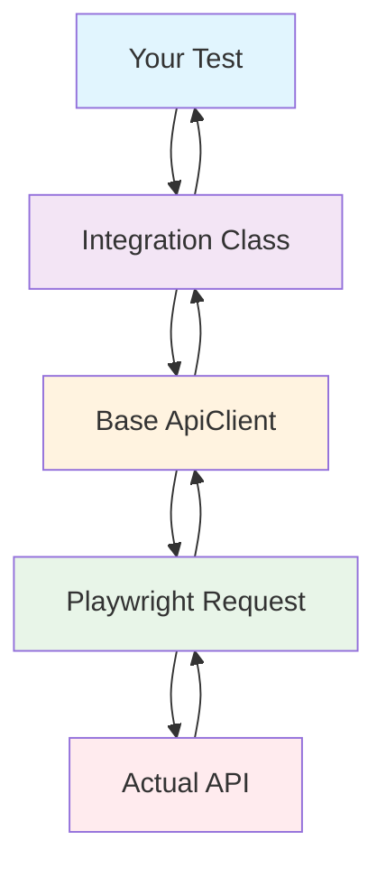

# API Integrations Guide

_Author: Anand Sogalad_

## 📖 Table of Contents

1. [Overview](#overview)
2. [Getting Started](#getting-started)
3. [Architecture](#architecture)
4. [Authentication API](#authentication-api)
5. [Creating New Integrations](#creating-new-integrations)
6. [Best Practices](#best-practices)
7. [Troubleshooting](#troubleshooting)
8. [Examples](#examples)

## 🌟 Overview

The API Integrations layer provides a clean, organized way to interact with external APIs in your test automation framework. Think of it as a bridge between your tests and the actual API endpoints you want to test.

### What Are API Integrations?

API integrations are specialized classes that:

- **Simplify API calls**: Turn complex HTTP requests into simple method calls
- **Handle errors automatically**: Built-in error handling so you don't have to worry about network issues
- **Provide type safety**: TypeScript interfaces ensure you pass the right data
- **Organize your code**: Keep all API-related code in one place

### Why Use This Approach?

Instead of writing raw HTTP requests in every test, you get:

- ✅ **Consistency**: All API calls follow the same pattern
- ✅ **Reusability**: Write once, use in multiple tests
- ✅ **Maintainability**: Change an endpoint in one place, not 50 test files
- ✅ **Type Safety**: Catch errors before running tests

## 🚀 Getting Started

### Quick Start Example

Let's see how easy it is to test a login API:

```typescript
import { test, expect } from '@playwright/test';
import { AuthApi } from '@integrations';

test('User can login successfully', async ({ request }) => {
  // Step 1: Create the API client
  const authApi = new AuthApi(request);

  // Step 2: Call the login method
  const response = await authApi.login({
    email: 'user@example.com',
    password: 'mypassword',
  });

  // Step 3: Check the result
  expect(response.status()).toBe(200);

  // Step 4: Verify response data
  const responseData = await response.json();
  expect(responseData.status).toBe('success');
});
```

That's it! No need to worry about:

- Building HTTP requests manually
- Handling network errors
- Managing request headers
- Parsing responses

### Basic Workflow

1. **Import** the API integration class you need
2. **Create** an instance with Playwright's request context
3. **Call** the method for the operation you want to test
4. **Verify** the response using Playwright's assertions

## 🏗️ Architecture

### Directory Structure

```
src/integrations/
├── index.ts           # Main export file - import everything from here
├── auth.api.ts        # Authentication operations
├── user.api.ts        # User management (coming soon)
├── data.api.ts        # Data operations (coming soon)
└── system.api.ts      # System operations (coming soon)
```

### How It Works



### Inheritance Chain

```typescript
AuthApi extends ApiClient
             ↳ Handles HTTP methods (GET, POST, PUT, DELETE)
             ↳ Manages error handling
             ↳ Provides logging and debugging
```

## 🔐 Authentication API

The `AuthApi` class handles all authentication-related operations.

### Available Methods

#### `login(credentials)`

Authenticates a user with email and password.

**Parameters:**

- `email` (string): User's email address
- `password` (string): User's password
- `forceLogin` (boolean, optional): Force login even if already logged in

**Returns:** Promise\<APIResponse\>

**Example:**

```typescript
const response = await authApi.login({
  email: 'admin@company.com',
  password: 'securePassword123',
  forceLogin: true,
});
```

#### `logout()` _(Coming Soon)_

Logs out the current user session.

#### `refreshToken()` _(Coming Soon)_

Refreshes the authentication token.

### Type Safety

Pass credentials as a regular object with the expected properties:

```typescript
import { AuthApi } from '@integrations';

const credentials = {
  email: 'user@example.com',
  password: 'mypassword',
  forceLogin: false,
};

const response = await authApi.login(credentials);
```

### Error Handling

The AuthApi automatically handles common errors:

```typescript
try {
  const response = await authApi.login({
    email: 'wrong@email.com',
    password: 'wrongpassword',
  });
} catch (error) {
  // Automatically handles:
  // - Network timeouts
  // - Server errors (500, 502, etc.)
  // - Invalid JSON responses
  console.error('Login failed:', error.message);
}
```

## 🔧 Creating New Integrations

### Step 1: Create the API Class

Create a new file in `src/integrations/` (e.g., `user.api.ts`):

```typescript
// External library imports
import type { APIRequestContext, APIResponse } from '@playwright/test';

// Core framework imports
import { ApiClient } from '@utils/api';
import { ApiEndpoints } from '@core/constants';

/**
 * @fileoverview User Management API Integration Service
 * @description Provides user management operations
 */

export class UserApi extends ApiClient {
  constructor(request: APIRequestContext) {
    super(request);
  }

  async createUser(userData: Record<string, unknown>): Promise<APIResponse> {
    return this.post(ApiEndpoints.CREATE_USER, {
      data: userData,
    });
  }

  async getUser(userId: string): Promise<APIResponse> {
    return this.get(`${ApiEndpoints.GET_USER}/${userId}`);
  }
}
```

### Step 2: Add API Endpoints

Add your endpoints to `src/core/constants/api.constants.ts`:

```typescript
export const ApiEndpoints = {
  LOGIN: '/api/rest/v2/accounts/login',
  CREATE_USER: '/api/rest/v2/users',
  GET_USER: '/api/rest/v2/users',
  // Add more endpoints here
} as const;
```

### Step 3: Export in Index File

Add your new API to `src/integrations/index.ts`:

```typescript
// User Management API Services
export { UserApi } from './user.api';
```

### Step 4: Write Tests

Create tests using your new integration:

```typescript
import { test, expect } from '@playwright/test';
import { UserApi } from '@integrations';

test('Create new user', async ({ request }) => {
  const userApi = new UserApi(request);

  const response = await userApi.createUser({
    name: 'John Doe',
    email: 'john@example.com',
    role: 'user',
  });

  expect(response.status()).toBe(201);
});
```

## ✨ Best Practices

### 1. Use Meaningful Method Names

❌ **Don't:**

```typescript
async doLogin(data: any): Promise<APIResponse>
```

✅ **Do:**

```typescript
async login(credentials: LoginRequest): Promise<APIResponse>
```

### 2. Define Clear Interfaces

❌ **Don't:**

```typescript
async createUser(data: Record<string, unknown>): Promise<APIResponse>
```

✅ **Do:**

```typescript
async createUser(userData: Record<string, unknown>): Promise<APIResponse>
```

### 3. Add Comprehensive Documentation

Always include:

- **@fileoverview**: What this integration does
- **@param**: Describe each parameter
- **@returns**: What the method returns
- **@example**: Show how to use it
- **@throws**: When it might fail

### 4. Handle Edge Cases

```typescript
async login(credentials: Record<string, unknown>): Promise<APIResponse> {
  // Validate input
  if (!credentials.email || !credentials.password) {
    throw new Error('Email and password are required');
  }

  return this.post(ApiEndpoints.LOGIN, {
    data: credentials,
  });
}
```

### 5. Use Consistent Error Messages

```typescript
// Follow the pattern from APIErrorMessages constants
throw new Error('Invalid login credentials provided');
```

## 🔍 Troubleshooting

### Common Issues

#### 1. "Cannot find module '@integrations'"

**Problem:** Import path not working
**Solution:** Make sure you're importing from the correct path:

```typescript
// ✅ Correct
import { AuthApi } from '@integrations';

// ❌ Wrong
import { AuthApi } from '../integrations/auth.api';
```

#### 2. "Property 'login' does not exist"

**Problem:** TypeScript can't find the method
**Solution:** Check your imports and make sure the class is exported:

```typescript
// In auth.api.ts
export class AuthApi extends ApiClient {
  // methods here
}

// In index.ts
export { AuthApi } from './auth.api';
```

#### 3. Network timeouts or connection errors

**Problem:** API calls are failing
**Solution:** The base ApiClient handles these automatically, but check:

- Is your test environment running?
- Are the API endpoints correct?
- Check the console for detailed error messages

#### 4. "Request failed with status 500"

**Problem:** Server error
**Solution:** This is automatically handled by ApiClient, but you can:

- Check server logs
- Verify your request data is correct
- Ensure the API endpoint exists

### Debug Mode

Enable detailed logging by setting environment variables:

```bash
DEBUG=1 npm run test:api
```

This will show:

- Request URLs and methods
- Request/response headers
- Response status codes
- Error details

## 📚 Examples

### Example 1: Basic Authentication Test

```typescript
import { test, expect } from '@playwright/test';
import { AuthApi } from '@integrations';

test.describe('Authentication Tests', () => {
  test('Valid user can login', async ({ request }) => {
    const authApi = new AuthApi(request);

    const response = await authApi.login({
      email: 'admin@company.com',
      password: 'admin123',
    });

    expect(response.status()).toBe(200);

    const data = await response.json();
    expect(data.status).toBe('success');
    expect(data.token).toBeDefined();
  });

  test('Invalid credentials are rejected', async ({ request }) => {
    const authApi = new AuthApi(request);

    const response = await authApi.login({
      email: 'wrong@email.com',
      password: 'wrongpassword',
    });

    // Should still return 200 but with failure status
    expect(response.status()).toBe(200);

    const data = await response.json();
    expect(data.status).toBe('failure');
  });
});
```

### Example 2: Data-Driven Testing

```typescript
import { test, expect } from '@playwright/test';
import { AuthApi } from '@integrations';

const testCredentials = [
  { email: 'user1@test.com', password: 'pass1', shouldSucceed: true },
  { email: 'user2@test.com', password: 'pass2', shouldSucceed: true },
  { email: 'invalid@test.com', password: 'wrong', shouldSucceed: false },
];

test.describe('Login with multiple users', () => {
  testCredentials.forEach((cred, index) => {
    test(`Login test ${index + 1}: ${cred.email}`, async ({ request }) => {
      const authApi = new AuthApi(request);

      const response = await authApi.login({
        email: cred.email,
        password: cred.password,
      });

      expect(response.status()).toBe(200);

      const data = await response.json();
      if (cred.shouldSucceed) {
        expect(data.status).toBe('success');
      } else {
        expect(data.status).toBe('failure');
      }
    });
  });
});
```

### Example 3: API Response Validation

```typescript
import { test, expect } from '@playwright/test';
import { AuthApi } from '@integrations';

test('Login response has correct structure', async ({ request }) => {
  const authApi = new AuthApi(request);

  const response = await authApi.login({
    email: 'user@example.com',
    password: 'password123',
  });

  expect(response.status()).toBe(200);

  const data = await response.json();

  // Validate response structure
  expect(data).toHaveProperty('status');
  expect(data).toHaveProperty('token');
  expect(data).toHaveProperty('user');

  // Validate data types
  expect(typeof data.status).toBe('string');
  expect(typeof data.token).toBe('string');
  expect(typeof data.user).toBe('object');

  // Validate user object
  expect(data.user).toHaveProperty('id');
  expect(data.user).toHaveProperty('email');
  expect(data.user.email).toBe('user@example.com');
});
```

---

## 🤝 Contributing

When adding new API integrations:

1. **Follow the existing patterns** shown in `auth.api.ts`
2. **Add comprehensive JSDoc documentation**
3. **Define TypeScript interfaces** for request/response data
4. **Export everything** through `index.ts`
5. **Write tests** to verify your integration works
6. **Update this documentation** with your new integration

## 📞 Need Help?

- Check the [API documentation](./api.md) for more details about the base ApiClient
- Look at existing integrations for examples
- Review the test files to see how integrations are used
- Ask the team for help with complex integrations

Remember: The goal is to make API testing as simple and reliable as possible for everyone on the team! 🎯
